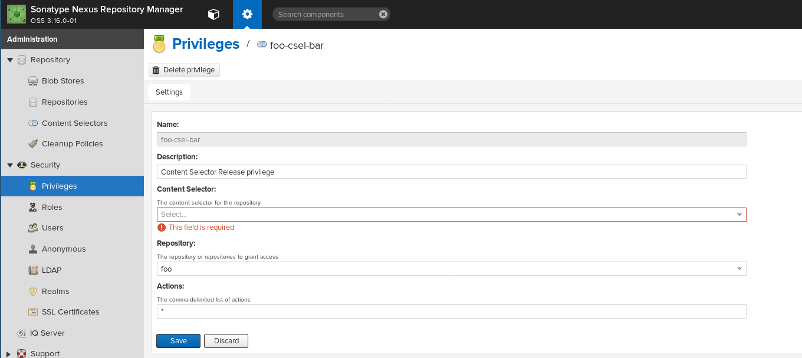

# Nexus 3 Scripts

 Various Nexus 3 Groovy scripts to manage repositories, privileges and content selectors.

# Issues

## Privileges UI Glitch

For privileges created via scripting API, the associated content selector is not selected in the web UI:

The script `run.sh` should help reproducing this.

